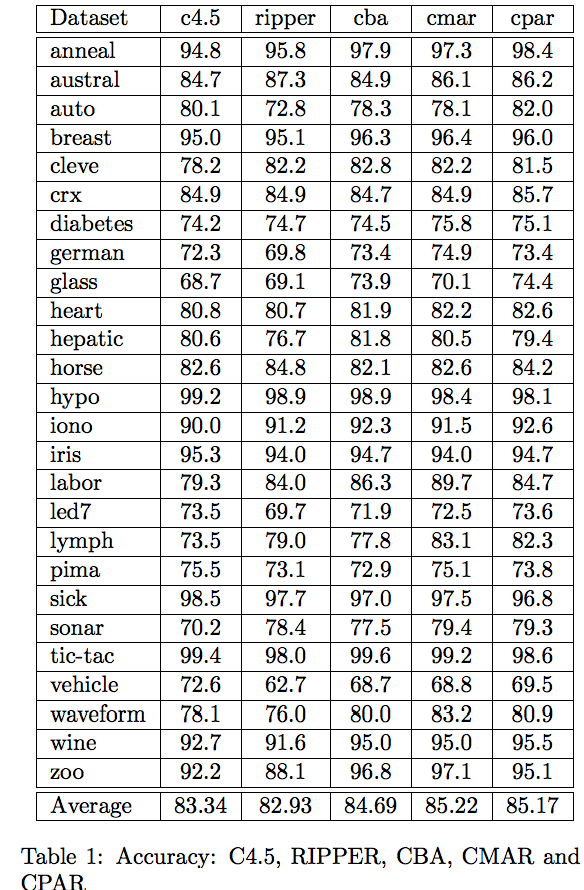
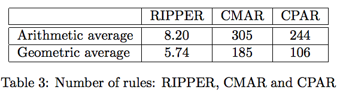
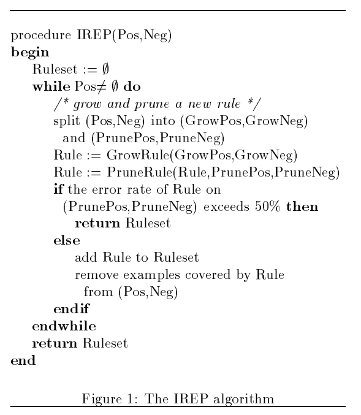

## CPAR: Classification based on Predictive Association Rules

[Yin, X., & Han, J. (2003, May). CPAR: Classification based on predictive association rules. In Proceedings of the 2003 SIAM International Conference on Data Mining (pp. 331-335). Society for Industrial and Applied Mathematics.][CPAR_2003]

Rule based classification의 대략적인 소개가 나옴. 

First Order Inductive Learner (FOIL)의 경우는 rule expansion을 위한 gain을 계산하는데 매우 비싸기 때문에 Predictive Rule Mining (PRM)에서 PNArray라는 구조를 제안하였음. 

PRM의 경우 Decision Tree와 같이 greedy하게 하나의 변수를 기준으로 rules을 expansion 시키는데, greedy하게 best인 rules가 전체의 best rules은 아니기 때문에 overfitting 이 발생하고, 이로 인하여 performance가 떨어진다고 주장. 

Rules이 표현하는 범위에 overlap을 두고 weight decaying을 함으로써, 좀 더 global best rules이 될 수 있도록 유도. 

그러나 UCI dataset으로 평가한 성능에서 성능이 크게 오르지 않음, 심지아 RIPPER라는 방법은 규칙의 개수가 매우 적음에도 불구하고 비슷한 성능을 보이고 있음. 

이 논문은 매우 중요한 논문은 아니라고 판단, RIPPER나 survey paper를 찾아보기로 함. 

## Fast effective rule induction (RIPPER)

[Cohen, W. W. (1995, July). Fast effective rule induction. In Proceedings of the twelfth international conference on machine learning (pp. 115-123).][RIPPER_1995]

이 논문은 association rules를 찾는 방법에 집중하기 보다는 rule pruning의 과정을 거치면서 간단한 rules를 정제하는데 더 중점을 두고 있으며, 이를 위하여 규칙을 학습하기 위한 growing set과 규칙을 정제하기 위한 pruning set을 나누고 있음. 

RIPPER 알고리즘의 큰 구조는 Incremental Reduced Error Pruning (IREP)과 같기 떄문에 IREP의 구조를 이용하여 설명을 하고 있음 (아래 그림)

IREP은 하나의 클래스 (Positive class; Pos)의 데이터에 대하여 이를 설명하는 rule 하나를 선택한 뒤, pruning 할지 말지 결정을 하고, 추가되는 rule에 의하여 covered되는 (Pos, Neg) 데이터를 모두 지운다. 그리고 남은 데이터에 대하여 새로운 rule을 찾는다. 이 점에서 association rule은 one-class classifier와 같다고 말할 수 있다. 

또한 하나의 rule은 하나의 tree와 같은데, 하나의 association rule은 모든 변수를 이용하지 않는다는 측면에서 Random Forest를 구성하는 하나의 tree와 같고, 여러개의 association rule based classifier/regression은 Random Forest classifier/regression과 같다. 

이런 이유에서 Decision Tree보다 Association Rules이 더 좋을 수 밖에 없는 이유는 DT의 경우에는 parents에서 사용된 Attributes를 children에서 반드시 이용해야만 한다 (상속). 이는 공간을 greedy하게 자르는 효과가 있어 각 subrules에 의하여 공간이 겹치지 않게 되는데, Association Rules는 이러한 제약조건 없이 데이터를 설명 잘하는 규칙을 찾기 때문에 설명력/판별력의 관점에서 항상 Decition Tree보다 상위호환이다. 하지만 계산비용의 관점에서 더 비싸다. 

Pruning은 'deleting any final sequence of conditions from the rule', pruning set에서의 성능이 올라갈 수 있는 attribute를 지우는 과정이다. 

RIPPER에서 multi-class의 imbalanced problems도 다루고 있는데, C1, C2, ..., Ck에 대하여 minority 순으로 정렬한다. 그리고 minor class부터 Rules를 추출한다. 추출된 rules에 의하여 covered된 (Pos, Neg)는 모두 growing set에서 지우고 다음 class에 대하여 규칙을 추출한다. 이는 Ci와 관련된 rule set Ri에 의해 covered된 Cj의 데이터들이 함께 지워지더라도, Ci보다 더 큰 집합에 있는 데이터이기 때문에 다음 라운드에서 큰 정보의 손실이 없을 것이라 가정한 것이다. 즉 multi-class에서 imbalance problems을 minority class의 one-class classifier를 학습함으로써 해결하려 하였다. 

Random Forest가 attributes에 대하여 샘플링을 하지만 데이터에 대해서는 sampling을 하지 않음과 비교하여, Association Rules은 rules로 잘 설명이 되는 영역에 대해서만 classifier를 만든다는 차이가 있다. Random Forest는 데이터의 샘플링을 하지 않음으로써 매우 빠르게 계산을 하는 장점을 가졌지만, 날카로운 규칙을 만드는 점을 포기했다고 생각한다. 둘은 서로 취하고 버리는게 확실히 다른 rule miner이다. 

이 논문은 Association Rules에서도 imbalance problems을 다루고, rule pruning을 통하여 해석가능한, 가벼운 classifier를 찾는다는 점에서 가치가 있다. 

이후로 읽으면 좋을 논문 paths 중 하나는 (1) rules를 실제로 계산하는 [Apriori][APRIORI_1994], [CBA][CBA_1998], [CN2][CN2_1989], [BDL][BDL_2015]나 (2) Decision Tree (C4.5) -> [Random Forest][RF_2001] -> [Gradient Boosting][GB_2001] -> [XGBoosting][XGBOOST_2016] 이다.

## To be reviewed

1. [R. Agrawal and R. Srikant. Fast algorithms for mining association rules in large databases. In VLDB, 1994.][APRIORI_1994]
1. [B. Liu, W. Hsu, and Y. Ma. Integrating classification and association rule mining. In KDD, 1998.][CBA_1998]
1. [P. Clark and T. Niblett. The CN2 induction algorithm. Machine Learning, 3(4):261–283, 1989.][CN2_1989]
1. [B. Letham, C. Rudin, T. H. McCormick, and D. Madigan. Interpretable classifiers using rules and Bayesian analysis: Building a better stroke prediction model. Annals of Applied Statistics, 9(3):1350–1371, 2015][BDL_2015] 
1. [Friedman, Jerome H. "Greedy function approximation: a gradient boosting machine." Annals of statistics (2001): 1189-1232.][GB_2001]
1. [Breiman, Leo. "Random forests." Machine learning 45.1 (2001): 5-32.][RF_2001]
1. [Chen, Tianqi, and Carlos Guestrin. "Xgboost: A scalable tree boosting system." Proceedings of the 22Nd ACM SIGKDD International Conference on Knowledge Discovery and Data Mining. ACM, 2016.][XGBOOST_2016]
<!-- References
-->

[CPAR_2003]: https://www.researchgate.net/profile/Xiaoxin_Yin/publication/2560610_CPAR_Classification_based_on_Predictive_Association_Rules/links/54341fe70cf2bf1f1f27b8a6.pdf
[RIPPER_1995]: https://pdfs.semanticscholar.org/2d5f/21740caf3c834101060b7a6d505780a299dd.pdf
[APRIORI_1994]: http://www.vldb.org/conf/1994/P487.PDF
[CBA_1998]: https://www.aaai.org/Papers/KDD/1998/KDD98-012.pdf
[CN2_1989]: https://link.springer.com/article/10.1007/BF00116835
[BDL_2015]: https://arxiv.org/abs/1511.01644
[RF_2001]: https://link.springer.com/article/10.1023%2FA%3A1010933404324?LI=true
[GB_2001]: https://statweb.stanford.edu/~jhf/ftp/trebst.pdf
[XGBOOST_2016]: http://dl.acm.org/citation.cfm?id=2939785

